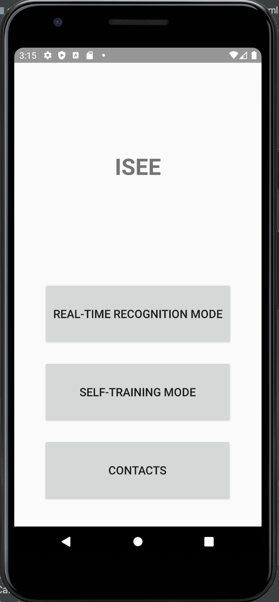
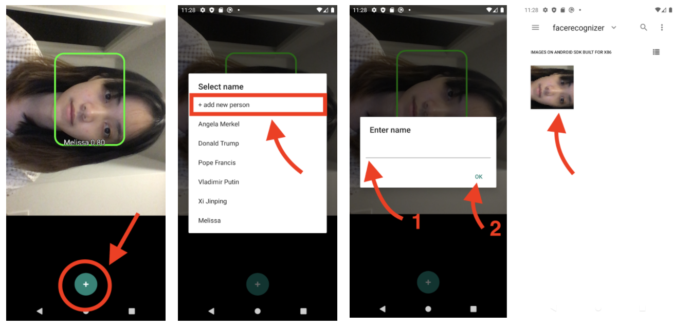
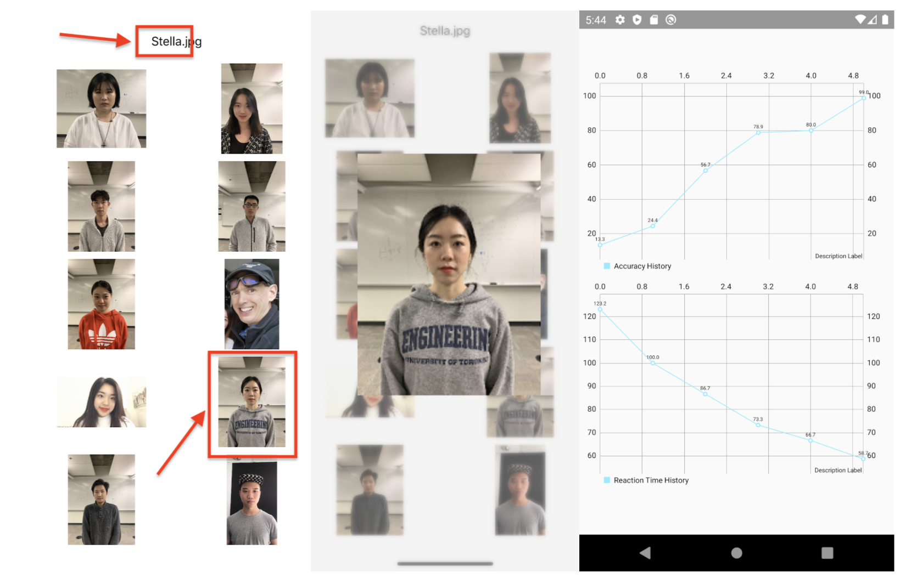
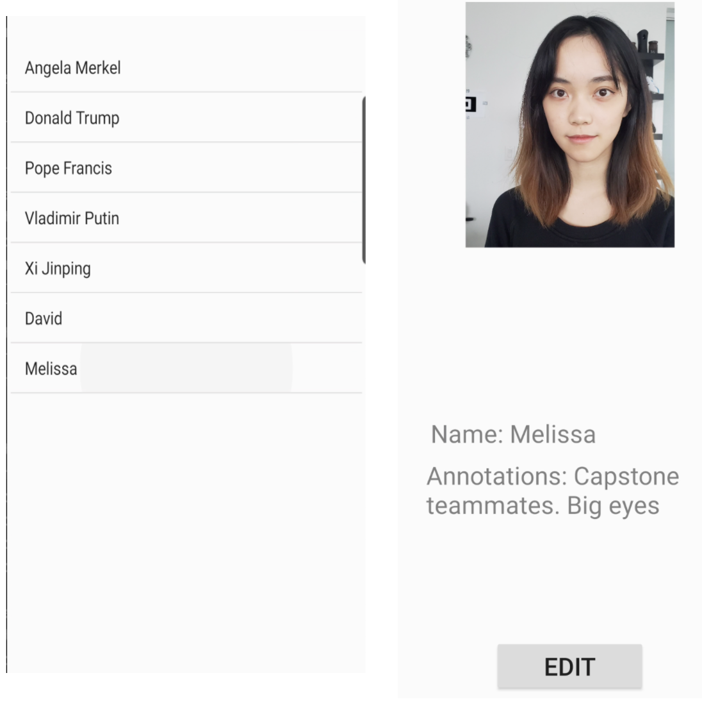

# Visual-Memory Prosthetic

This sample demonstrates realtime face recognition on Android. The project is based on the [Face Recognizer](https://github.com/pillarpond/face-recognizer-android).

## Screenshots
App Home page:

### Real-time recognition mode: 
Video streamed from the perspective of the user to the interacting human subject.
The face recognition model (FaceNet) generates an unique face encoding to compare with data record. 
Audio notification is given on contact information if match found, else prompt as unknown.
The user is able to add new person as contact through selecting training images.
Supports multi-face recognition.

### Self-training mode:
The at-home self-training mode is an interactive interface that allows the user to train on their face-naming ability. The user is trained with an algorithm that mimics the clinical training, where the faces are fetched from the database.  The self-training mode draws 10 pictures each round in the database and displays one name on the top of the screen. Then the user is supposed to tap on the photo which corresponds to the name. If the user makes the right choice, then again 10 pictures are drawn from the database. If the user fails to choose the right picture of the person, then the correct photo appears on the screen until the user taps again to proceed to another round. At the end of 15 rounds of practice, the user’s training accuracy and total reaction time are presented in the center of the screen.

### Contact Management:
User can view and edit their contact list information

